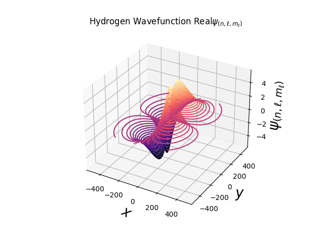
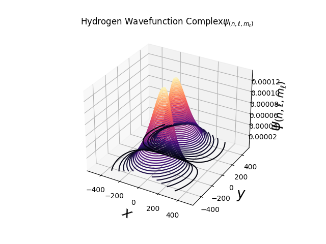

# The Hydrogen Wavefunction & Electron Density Cloud Plot

### Execution of File
To execute the Python file, you must first follow these items, (1.1 Language). Execution is done through the Python terminal by entering your quantum numbers with set restrictions stated below.

  
| Quantum Number | Limitations                                 |
| -------------- | ------------------------------------------- |
| $$n$$          | $$n \geq  1$$                               |
| $$ℓ$$          | $$0 \leq  l \lt  n$$                        |
| $$m_ℓ$$        | $$-ℓ \leq m_ℓ \leq ℓ$$                      |

After execution, a 3D interactable figure will pop up via Matplotlib and will save a .png file within the respective Python file directory where ever that may be on your device. If the Wavefunction Plot is not within the bounds, try adjusting the Global Constants to a larger value by an addition of 500 for both. This portion is not automated, but will be in the future.

Figure examples are shown below for: $n = 2, l = 1, m_ℓ = 1$

  <h3> Real Hydrogen Wavefunction </h3>
  
  
  <h3> Complex Hydrogen Wavefunction </h3>
  

## 1. Pre-requisites

### 1.1 Language
Python (3.11.2 64-bit) was the main method behind the plot file and makes use of many libraries for ease of code visualization. Libraries and main imports include,

* Math (Internal)
* NumPY (1.24.3)
* SciPY (1.11.2)
* Matplotlib (3.7.2)

### 1.2 Basis Knowledge
As the topic of the electron cloud density is complex to calculate, a foundation in Multivariable Calculus, the general idea of Quantum Mechanics, and knowledge of Laugerre Polynomials/Legendre Polynomials would be beneficial. However, I will try my best to explain the process.

## 2. Foundation Explanation
If you already have the basis knowledge down you may skip this section as it is a revision and explanation portion. Only necessary ideas will be conveyed in this section, assuming you have the foundation in algebra and function analysis. Resources will be provided as per section explanation.

### 2.1 Multivariable Calculus 

#### 2.1.1 Spherical Coordinates 
Spherical Coordinates is formally defined to be a coordinate system for an n-dimension Euclidean space where $(n = 3)$ with the following parameters:

1) The Radial Distance (radius, or radial coordinate), being the distance from the origin to the point as a straight line (magnitude). $$r,ρ \left \( 0 \leq r,ρ \right \)$$ 

2) The Polar Angle, being the angle (typically in radians) from the x - axis, counter clockwise stopping at the xy projection of r. $$\theta \left \( 0 \leq \theta \lt 2\pi \right \)$$ 

3) The Azimuth Angle, being the angle (typically in radians) from the z - axis, being the direct angle stopping at r. $$\phi \left \( 0 \leq \phi  \leq \pi \right \)$$

  <h3> Spherical Coordinate Definition </h3>
  

Note: that theta ($\theta$) and phi ($\phi$) could be defined in either order (theta being phi and vice versa). This is up to the discretion of whoever is applying it. For this case, it will be hard defined as stated above.

The direct translation from Cartesian to Spherical is as follows:
$$r,ρ = \sqrt{x^2 + y^2 + z^2}$$
$$\theta = \arctan{\frac{y}{x}}$$
$$\phi = \arccos{\frac{z}{\sqrt{x^2 + y^2 + z^2}}}$$

All in all, the Spherical Coordinate System is another way of plotting any particular point in 3D space rather than using the Cartesian Coordinate System $(x, y, z)$. Spherical coordinates has many advantages over the Cartesian Coordinate System as it applies for the wavefunction which will be discussed further. 

Due note that the possibility of a function may be in terms of Spherical Parameters rather than Cartesian Parameters.

An excellent resource on Spherical Coordinates is linked here from Paul's Online Notes: https://tutorial.math.lamar.edu/classes/calciii/SphericalCoords.aspx

### 2.2 Atomic Shape
The shape of the atomic is depicted from different models of teachings in North America. We will be analyzing the higher format of energy levels, orbital axes, and formulation of quantum numbers. 

#### 2.2.1 Atomic Orbitals
The orbitals describe differnet probability clouds around the nucleus of the atom. Finding these probability clouds will be discussed later on under the wavefunction but for now, we assume there is a set probability distributed around the nucleus. 

Examples are shown below for a single electron in Hydrogen below,

  <h3> Atomic Orbitals in Hydrogen </h3>
  

#### 2.2.2 Quantum Numbers
Four quantum numbers describe the movement and trajectory of an electron within the atom. With the Pauli Exclusion Principle, there are no pair of electrons that share the exact same quantum numbers. The quantum numbers and their limitations are stated below,

1. $(n)$ - The Principal Quantum Number describes the principal electron shell as it shows the most probable distance from the nucleus. As we increase in $(n)$, the distance increases from the nucleus to the electron.

2. $(ℓ)$ - The Angular Momentum Quantum Number describes the shape of an orbital which is the Angular Distribution.  Each $(ℓ)$ indicates a specific subshell $(s,p,d,f)$ each unique with their own shape respectively. $(ℓ)$

3. ($m_ℓ$) - The Magnetic Quantum Number descirbes the number of orbitals and their respective orientation in space within a subshell. It is dependant on $(ℓ)$

4. ($m_s$) - The Electron Spin Quantum Number describes the direction of the electron spin either being strictly either $(\frac{1}{2})$ or $(-\frac{1}{2})$. It is independant of the 3 other quantum numbers.

Each quantum number has their respective limiation stated below,

  <h3> Quantum Number Boundaries</h3>
  
| Quantum Number | Limitations                                 |
| -------------- | ------------------------------------------- |
| $$n$$          | $$n \geq  1$$                               |
| $$ℓ$$          | $$0 \leq  l \lt  n$$                        |
| $$m_ℓ$$        | $$-ℓ \leq m_ℓ \leq ℓ$$                      |
| $$m_s$$        | $$-\frac{1}{2} \leq m_s \leq \frac{1}{2}$$  |

For a general overview of the atomic structure and the quantum numbers. I would recommend watching Professor Dave Explains on the topic: https://www.youtube.com/watch?v=Aoi4j8es4gQ

Note that for the probability density and the wavefunction in terms of quantum numbers, we will not consider the electron spin as it does not impose any general effect.
## 3. The Wavefunction for the Hydrogen Atom

### 3.1 Quantum Mechanics 
Quantum Mechanics expresses the theory that describes the physical nature of atoms and subatomic particles. A key feature about this theory is that rather than determining the location, momentum, or other physical propteries of the particle(s) in a specified system with minimalisitc uncertainty. It is determined with a probability instead. 

#### 3.1.1 Wavefunction

$(\Psi)$ represents the Quantum State of any particle in a given system as it is used in the Schrödinger Equation. It contains all the informatin about the particle in question.

Some restrictions are set as stated below,

1. $(\Psi)$ and its partial derivative counterpart $(\frac{\partial\Psi(x)}{\partial x})$ must be continuous
2. $(\Psi)$ must be a solution to the Schrödinger Equation
3. $(\Psi)$ must be normalized. 
$\lim_{x \to \infty} (\Psi) = 0$

#### 3.1.2 Probability Density
By evaluating $(|\Psi|^2)$. This gives the probability density function of finding the particle located in space. The resulting number showcases the probability of locating the particle at that point. 

#### 3.1.3 Schrödinger Equation (Time Independant)
The Schrödinger Equation was formed by Erwin Schrödinger. Considering the eigenvalue equation below,

$$ \hat{H}\Psi_n = E_n\Psi_n $$

This is an equation relating the Hamiltonian Operator of n-th eigenfunction to the Energy eigenvalue. Note that the Hamiltonian Operator takes in account of the Potential Energy and Kinetic Energy of the system as expressed below,

$$ \hat{H} = \frac{-\hbar^2}{2m}\nabla^2 +  V(x) $$

as $$\nabla^2 = \frac{\partial}{\partial x^2}$$

By a big leap through derivations, relations, and assumptions, we find the Partial Differential Equation of time independancy expressed below,

$$ i\hbar\frac{\partial\Psi}{\partial t} = \frac{-\hbar^2}{2m}\frac{\partial \Psi}{\partial x^2} + V(x)\Psi $$

By more big leaps. Solving this equation by seperation of variables finds the following,

$$ \Psi(x, t) = \psi(x)\tau(t) $$ $$ \tau(t) = Ae^{\frac{iEt}{\hbar}} $$ $$ \frac{-\hbar^2}{2m}\frac{\partial \psi}{\partial x^2} + V(x)\psi = E\psi$$

By even more big leaps, we can now solve a particular $\psi$, so that we can look for the Hydrogen Wavefunction equation in terms of quantum numbers as described in the next segment.

Note that due to the spherical symmetry of Hydrogen, we will consider Spherical Coordinates in terms of $(r,\theta,\phi)$ as parameters rather than $(x,y,z)$.

### 3.2 Schrödinger Equation for the Hydrogen Wavefunction (Time Independant)
For the following equations set below, please refer to the reference list stated after as they go in depth of attributing these equations.

Please note that these equations are set for a strictly time independant assumption from the initial Partial Differential Equation above.

#### 3.2.1 The Wavefunction as a product of the Radial and Angular Contributions.

### $$\psi_{(n,ℓ,m_ℓ)} = R_{n,ℓ}(r)\times Y_{ℓ,m_ℓ}(\theta,\phi)$$

#### 3.2.2 Radial Contribution

#### $$R_{(n,ℓ)}(r) = \sqrt{\left(\frac{2}{na_0}\right)^{3}\frac{(n-ℓ-1)!}{2n(n+1)!}}\left(\frac{2r}{na_0}\right)^{ℓ} L_{n-ℓ-1}^{2ℓ+1}\left(\frac{2r}{na_0}\right)e^{-\frac{r}{na_0}}$$

Some important clarification notes are,
1. $a_0$ is the Bohr radius as a set constant
2. $L$ being the Laguerre polynomials with the set bounds stated.

#### 3.2.3 Angular Contribution 

#### $$Y_{ℓ}^{m_ℓ}(θ,ϕ) = (-1)^{m_ℓ} \sqrt{\left(\frac{2ℓ+1}{4π}\right)\frac{(ℓ-m_ℓ)!}{(ℓ+m_ℓ)!}}P_{ℓ}^{m_ℓ}(cos(θ))e^{im_ℓϕ}$$

#### 3.2.4 Probability Density

#### $$P(r,\theta,\phi) = |\psi_{(n,ℓ,m_ℓ)}(r,\theta,\phi)|^2$$

Some important clarification notes are,
1. $e^{im_ℓ \phi}$ is the complex decay term. This results the total solution including a complex number.
2. $P$ being the Legendre polynomials with the set bounds stated.

## 4. References
#### [1] Martin Fränzl, Universität Leipzig, Molecular Nanophotonics Group, "The Hydrogen Atom" https://home.uni-leipzig.de/~physik/sites/mona/wp-content/uploads/sites/3/2017/12/Hydrogen_Atom.pdf
#### [2] The University of Washington, Physics 441, "Radial Wave Functions from the Solution of the Radial Equation" https://faculty.washington.edu/seattle/physics441/ch10b.pdf
#### [3] Wikipedia, "Vector Fields in Cylindrical Coordinates" https://en.wikipedia.org/wiki/Vector_fields_in_cylindrical_and_spherical_coordinates
